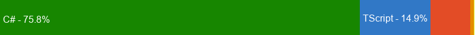

<h1 align="center">Hi 👋, I'm Iliya Likomanov</h1> 
<h3 align="center">I'm a Juniour Backend Engineer, from Bulgaria.</h3>

<h3 align="left">Contact me: iliyalikomanov@gmail.com</h3>
<h3 align="left">Check my application: https://datingapp-net8-z2rv.onrender.com</h3>

<h3 align="left">Languages and Tools:</h3>

       

### 📊 Language Usage in `DatingApp-net8`

- 🟢 **C#** – 63.3%
- 🔵 **TypeScript** – 22.5%
- 🔴 **HTML** – 12.7%
- 🟠 **CSS** – 1.3%
- 🟡 **Dockerfile** – 0.2%

---

## 🧪 Here are some of the technologies used to develop the application:

- Setting up the developer environment
- Creating the ASP.NET Core WebAPI and the Angular app using the DotNet CLI and the Angular CLI
- Adding a Client side login and register function to our Angular application
- Adding 3rd party components to add some features to the app
- Adding routing to the Angular application and securing routes.
- Using Automapper in ASP.NET Core
- Building a great looking UI using Bootstrap
- Adding Photo Upload functionality and a gallery in Angular
- Angular Template forms and Reactive forms and validation
- Paging, Sorting and Filtering
- Adding a Private Messaging system to the app
- Using SignalR for real time presence and live messaging between users
- Many more things as well

## 🧩 Third parties and additional resourses used:

- https://v17.angular.io/guide/setup-local - Angular
- https://github.com/FiloSottile/mkcert
- https://getbootstrap.com/docs/5.3/examples/carousel/ - nav component
- https://valor-software.com/ngx-bootstrap/#/components/dropdowns?tab=api - dropdown menu
- https://www.npmjs.com/package/ngx-toastr - toastr
- https://bootswatch.com/united/ - Bootswatch theme used
- https://json-generator.com/ - used to generate random users
- https://transform.tools/json-to-typescript - used to create "Member" interface from "Username" JSON data
- https://dbeaver.io/ - used to interact with DataBase and change picture to one user from 11 to 12 pictures from random user
- https://valor-software.com/ngx-bootstrap/#/components/tabs?tab=overview - Bootstrap tabs used
- https://ngx-gallery.netlify.app/#/ - Gallery used in project
- https://www.npmjs.com/package/ngx-spinner - spinner used
- https://cloudinary.com/ - upload photo
- https://www.npmjs.com/package/ng2-file-upload - added in project
- https://valor-software.com/ng2-file-upload/ - ng file uploader
- https://valor-software.com/ngx-bootstrap/#/components/datepicker?tab=overview - datepicker
- https://valor-software.com/ngx-bootstrap/#/components/pagination?tab=overview - pagination used
- https://valor-software.com/ngx-bootstrap/#/components/buttons?tab=overview - button used
- https://www.npmjs.com/package/ngx-timeago - ngx-timeago
- https://valor-software.com/ngx-bootstrap/#/components/modals?tab=overview - modals
